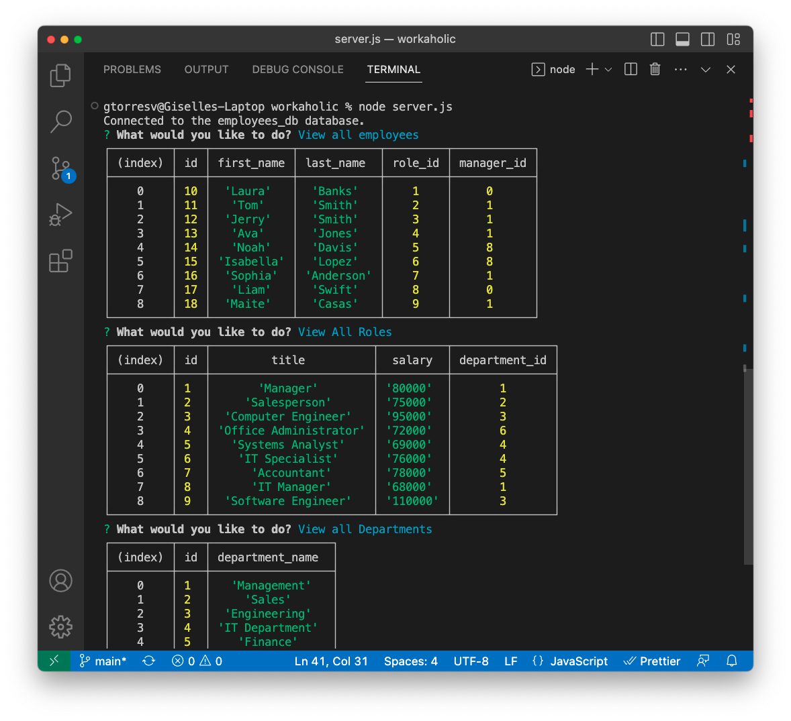
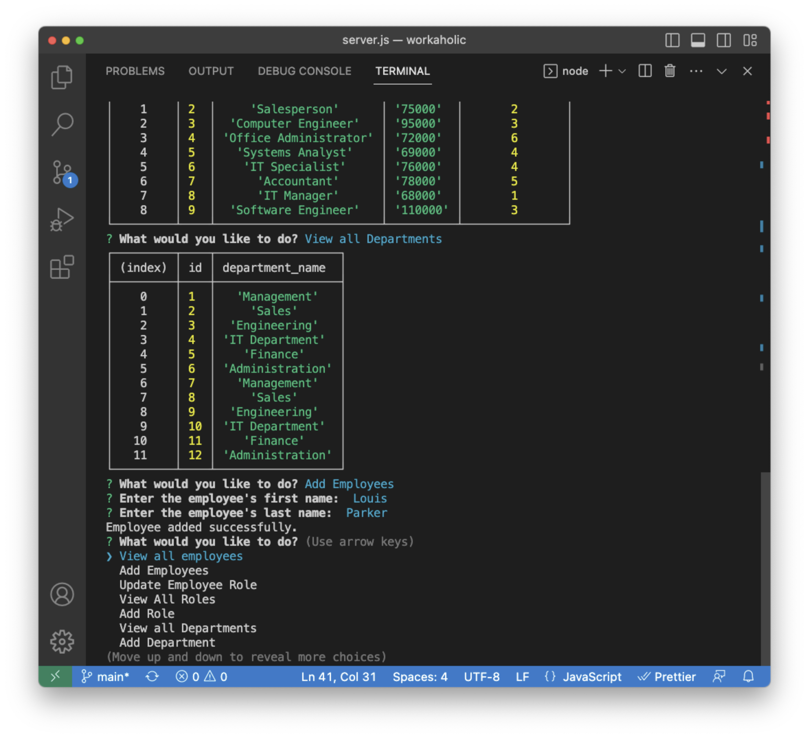

# Employee Tracker

## Description

Employee Tracker is an Employee Management System that is created as a command-line application designed for business owners to view and manage departments, roles, and employees in their company. It allows users to organize and plan their business effectively by providing a set of features for managing employee data. This app was created as an interfaced called content management system (CMS).

## Features

- View all departments
- View all roles
- View all employees
- Add a department
- Add a role
- Add an employee
- Update an employee's role

## Installation

If you have not done so, please install [MySQL](https://coding-boot-camp.github.io/full-stack/mysql/mysql-installation-guide) to your PC to be able to utilize the Employee Tracker.

## Usage

To be able to use the Employee Tracker you would have to clone the repository or download the app from https://github.com/gtorresv/workaholic. Once you are on the app, open up your terminal in VS Code and do a `npm install` on the command line to install all the necessary nodes. Before starting the app you need to make sure to set up your MySQL Database connection by providing your MySQL `user` and `password` fields. Afterwards, you can run the command `node server.js` to start the application. 
Now you can go ahead and follow the prompts to interact with the CMS. You can perform actions such as viewing employees, departments, roles, adding employees and more. 

The following screenshots are provided as samples of how the application works:

## Credits

N/A

## License

Please refer to the License in the repository.
